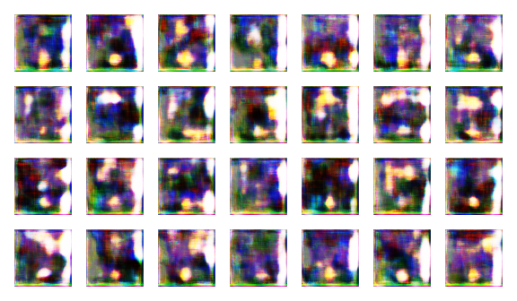
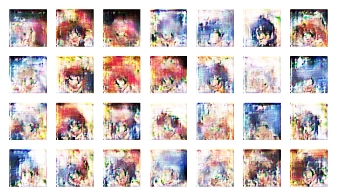
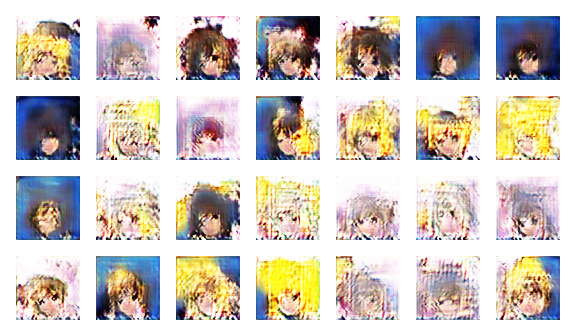
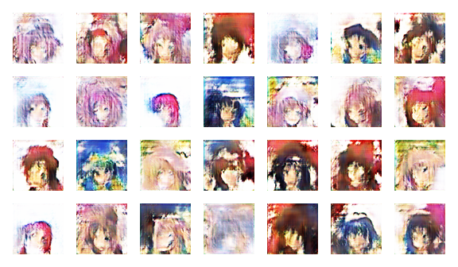

This is a simple implementation of the Generative Adversarial Network using Keras (Tensorflow backend) to generate Anime character faces.
This is just to understand the basic working of the network.
Due to unavailability of high computing resources, the training has been done in Google Colabs. I was able to train upto 4000 epochs before
the session kept on crashing for some reason. Here are some of the generated images

## Generated Image after 100 epoch

## Generated Image after 1000 epoch

## Generated Image after 2000 epoch

## Generated Image after 3000 epoch

